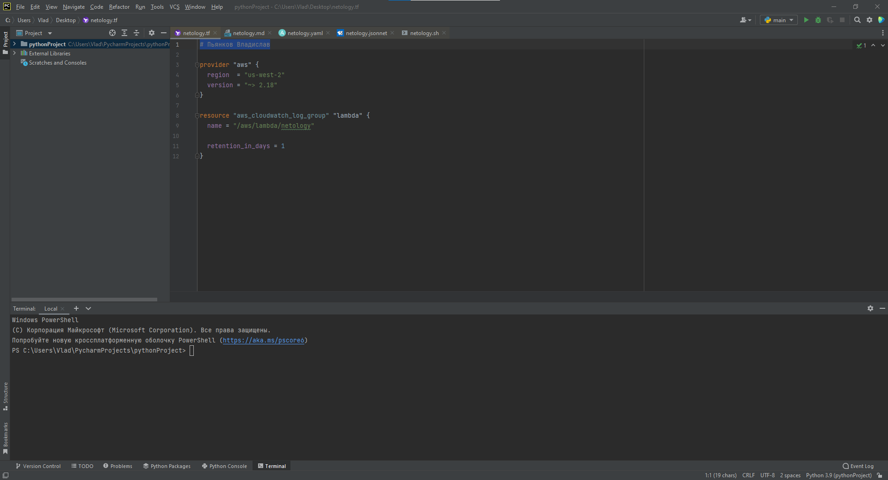
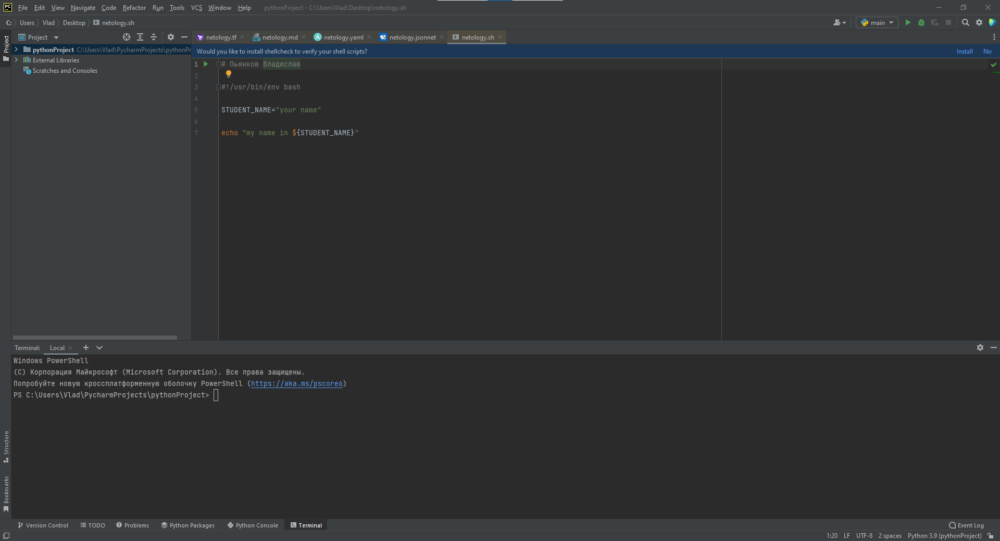
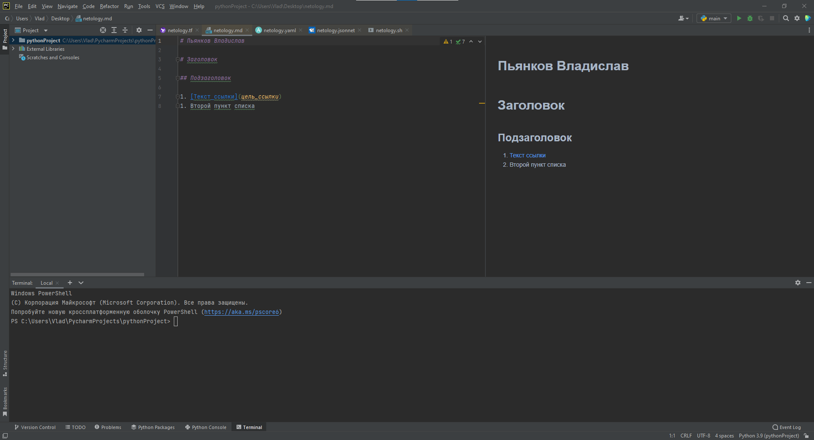
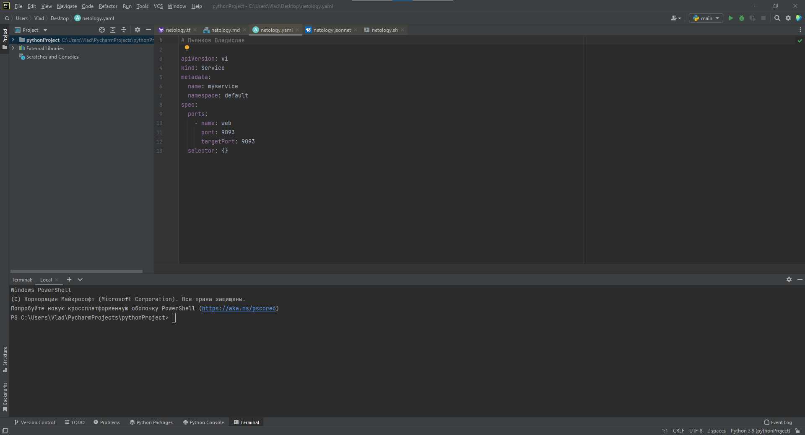
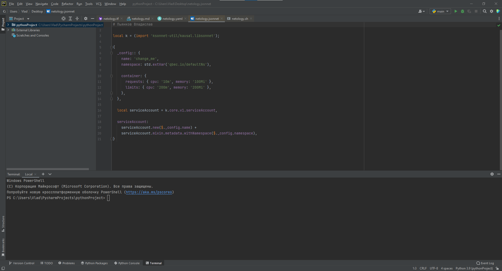

Пьянков Владислав
# Домашнее задание к занятию «1.1. Введение в DevOps»
## Задание №1 - Подготовка рабочей среды
- Terraform: 
- Bash: 
- Markdown: 
- Yaml: 
- Jsonnet: 
## Задание №2 - Описание жизненного цикла задачи (разработки нового функционала)
1. Заказчик высказывает свои пожелания
2. Менеджер ставит задачу разработчику
3. Разработчик выполняет поставленную задачу
4. Разработчик пишет тесты
5. Тестировщик проверяет работоспособность, если все хорошо то далее, нет то к пункту 3
6. Менеджер проверяет выполнение задачи, если да то далее, нет к пункту 3
7. Новый релиз

DevOps-инженер автоматизирует все этапы процесса. Настраивает безопасность, контроль доступа,
резервирование предыдущих версий, единообразность рабочих сред.
Учавствует в каждом этапе разработки и помогает договориться всем участникам процесса.
